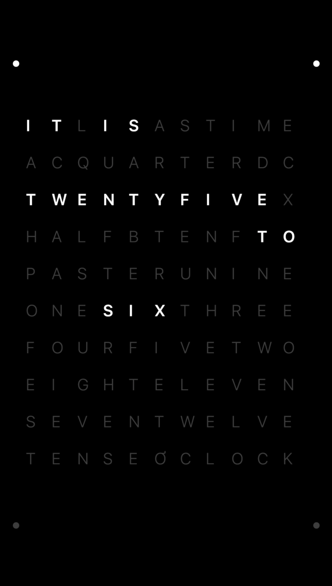
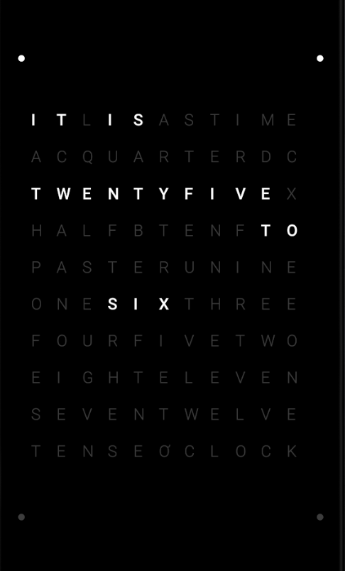

# chronology

Public repo for chronology, a [QLOCKTWO&reg;](https://qlocktwo.com/en/qlocktwo-classic/) clone built with Flutter.

A clock that tells time in words.
The time is displayed in five minute intervals.
It has a quadratic matrix of letters, where some of the letters are illuminated.
If you need to have a more exact time, look in the corners at the illuminated dots.

## What it looks like

| iOS | Android |
| --- | ------- |
|  |  |

## Features

* [x] Android platform
* [x] iOS platform
* [x] Tablet support (not fully tested)
* [x] Multpile themes (Swipe horizontally to change color)
* [x] Animation (Minute indicator only at the moment)
* [x] Multiple language support (English and German)

# What's Next?
 - [ ] Transition between words.
 - [ ] Support more languages.

## What is Flutter?

Flutter is a new project to help developers build high-performance,
high-fidelity, mobile apps for iOS and Android from a single codebase.
To learn more about Flutter, visit [flutter.io](https://flutter.io/).